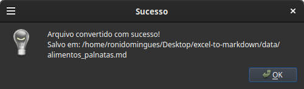

# Excel to Markdown Converter

## Features

- Convert Excel spreadsheets to Markdown format.
- User-friendly GUI and CLI interfaces.
- Supports multiple Excel sheets.

## Installation

1. Clone the repository:
   
   ```bash
   git clone https://github.com/ronidomingues/excel-to-markdown.git
   cd excel-to-markdown
   ```

2. Install the required packages:
    
    ```bash
   pip install -r requirements.txt
   ```

3. If you're using Linux, you may need to install additional dependencies for the GUI to work properly. Run the following command:
    
   ```bash
   sudo apt install libxcb-cursor0 libxcb-xinerama0 libxcb-icccm4 libxcb-image0 libxcb-keysyms1 libxcb-randr0 libxcb-render-util0
   ```

4. Run the application using your version of the Python interpreter:

   ```bash
   python3 main.py
   ```

## Usage

1. Launch the application and select CLI or GUI mode.

### GUI Mode

1. Select the Excel file you want to convert.
2. Choose the output directory for the Markdown file.
3. Click "Convert" to start the conversion process.
4. Once completed, you can find the Markdown file in the specified output directory.

#### Screenshot of GUI Mode

<p float="left">
   
   
   
   
   
</p>
